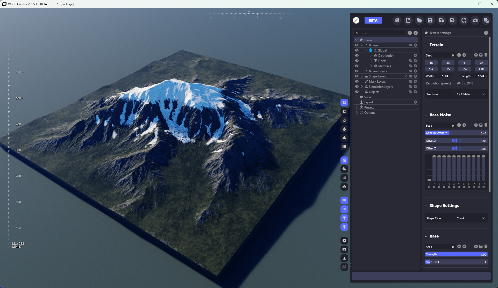
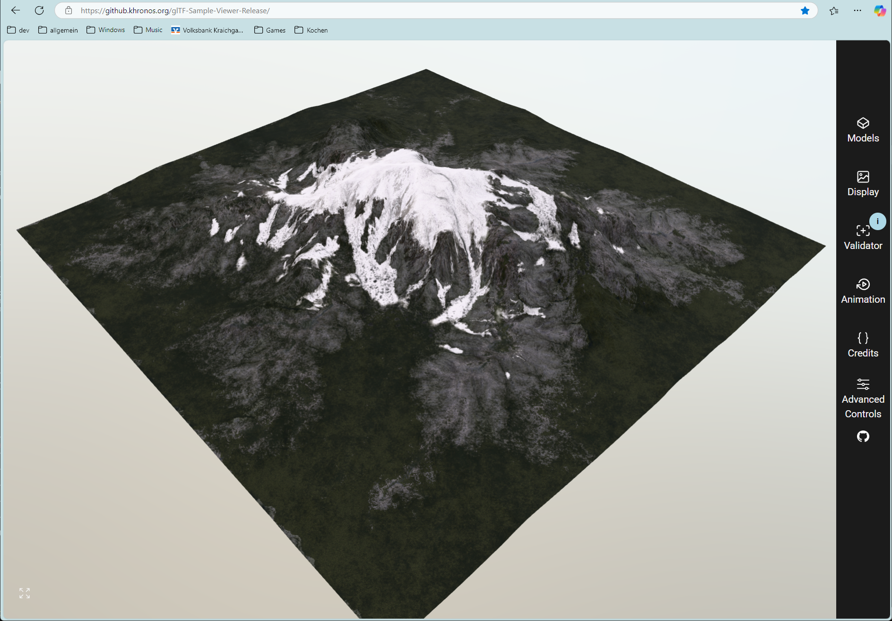
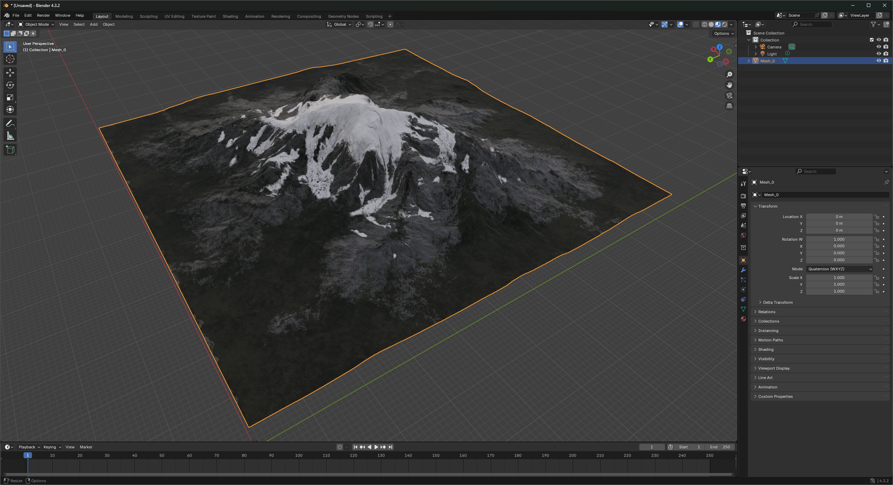

# WorldCreatorToGLTF
convert WorldCreator export files into glTF 2.0 metallic-roughness glb

## Overview
This project is a C++ application that imports maps created by WorldCreator and exports them as glTF 2.0 using the metal-roughness workflow.

## Usage

#### 1 Export files from WorldCreator

Load the project you want to have converted. We only tested with rectangular areas with a power of 2: Make sure your combination of Width/Length and resolution gives a pixel resolution of e.g. 512, 1024, 2048 or 4096. Check by clicking on *Terrain* in the object overview and look up the pixel resolution.

You may try with non-rectangular secenes or areas, but we did not test this.

Export all these files into the same folder:

- Mesh: Select Format Gltf2 and make sure you clicked the *Binary* option. Make sure to include *Texcoords* and *Normals*

- Color Map: Use format *Int8 Png* for this and all the other picture exports. We don't see any difference by selecting to include texture data. Any setting should do.

- Normal Map

- Roughness Map

- Ambient Occlusion Map

**Note: In all our tests (version 2025.1) the metallic and roughness maps were all 0 and 1, respectively. Cause unknown.**



### 2 Run Converter

Your input folder should looks like this:

Put the binary somewhere on your machine and run it like this (Sorry, we only provide the Windows binary):

```
./WorldCreatorToGLTF.exe Terrain "C:\wcexport"
```

Be sure to add quotation marks if your path contains space characters. Like so:
```
./WorldCreatorToGLTF.exe Terrain "C:\Users\cleme\OneDrive\Dokumente\World Creator\Export"
```
If all goes well you will see a message like this: ``Exported successfully to "C:\\wcexport\\Terrain.glb"``
Now use the binary glb file anywhere you like!

Usage in Khronos gltf viewer:


Usage in Blender:


Usage in gltf PBR Viewer by Sascha Willems (https://www.saschawillems.de)


Usage in our own engine (https://www.shadedpath.org)


## Development
This section is only important to you if you want to build the tool yourself. Maybe you want to debug it while running or you want to make modifications. If you only want to run the tool please see instructions above.

### Prerequisites
- CMake (version 3.10 or higher)
- A C++ compiler (e.g., GCC, Clang, MSVC)
- [vcpkg](https://github.com/microsoft/vcpkg) package manager

### Dependencies
This project uses the following libraries:
- Assimp
- tinygltf

Install with ``vcpkg install assimp tinygltf``

### Setup Instructions

```
   mkdir build
   cd build
   cmake ..
   cmake --build .
```

   